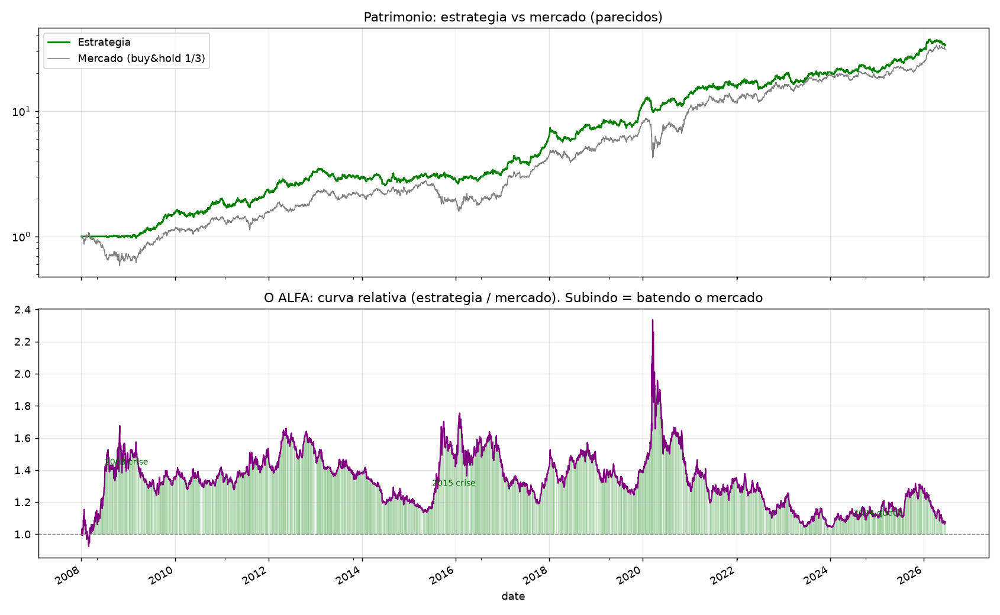

# Quant Momentum — Rotacao Dinamica

Estrategia sistematica de momentum cross-sectional com volatility targeting, aplicada a ITUB3, PRIO3 e ABEV3 (desde 2008). A cada dia o sistema aloca no ativo de maior momentum, dimensiona pela volatilidade e rotaciona quando outro lidera. O capital nao investido rende 100% do CDI. Long-only, sem alavancagem, liquido de custos.

## Resultados (desde 2008, liquido de custos)

| Versao | Sharpe | Sortino | Max Drawdown | Retorno |
|---|---|---|---|---|
| Pura (sem CDI, vs zero) | 1,09 | 1,58 | -26% | +3.257% |
| **Com CDI no caixa (vs CDI)** | **0,75** | **1,10** | **-25%** | **+5.660%** |
| Buy & Hold (1/3 cada) | 0,83 | 1,15 | -52% | +3.017% |

Nota honesta: no Brasil o risco-livre (CDI) e alto, entao o Sharpe e medido CONTRA o CDI (0,75 = habilidade real). O caixa rende CDI (sobe o retorno total), mas no Sharpe vs CDI esse ganho se neutraliza, sobrando so o quanto a parte investida bate o CDI. O 1,09 e a versao sem CDI, vs zero.


## Analise de alfa (atribuicao)

Apesar de a curva acompanhar o mercado, a regressao mostra que a estrategia nao e so beta:

| Metrica | Valor | Leitura |
|---|---|---|
| Beta | 0,49 | move ~metade do mercado |
| Alfa anualizado | +10,1% | retorno independente do mercado |
| R2 | 47% | o mercado explica menos da metade; 53% e idiossincratico |

O alfa e **defensivo** ("crisis alpha"): captura ~78% das altas e so ~60% das quedas, e a probabilidade de superar o mercado e 71% nos meses de queda (vs 32% nas altas). Resultado: retorno proximo ao do mercado com metade do drawdown. O beta cai de 0,79 (calmo) para 0,41 (estresse) — a estrategia se desexpoe sozinha nas crises.




## Como rodar
```bash
pip install -r requirements.txt
python3 rotacao_graf.py      # estrategia + grafico
python3 rotacao.py           # so as metricas
python3 sinais.py            # exporta a alocacao por ativo
```
Requer a pasta `dados/` com CSVs no formato `date,open,high,low,close,adjustedClose,volume`.

## Estrutura
| Arquivo | Conteudo |
|---|---|
| `rotacao.py` | Nucleo da estrategia (legivel, comentado) |
| `rotacao_graf.py` | Estrategia + grafico (3 paineis) |
| `sinais.py` | Exporta a alocacao diaria por ativo |
| `dados/` | Precos ajustados dos 3 ativos |

Stack: Python, pandas, numpy, matplotlib.
